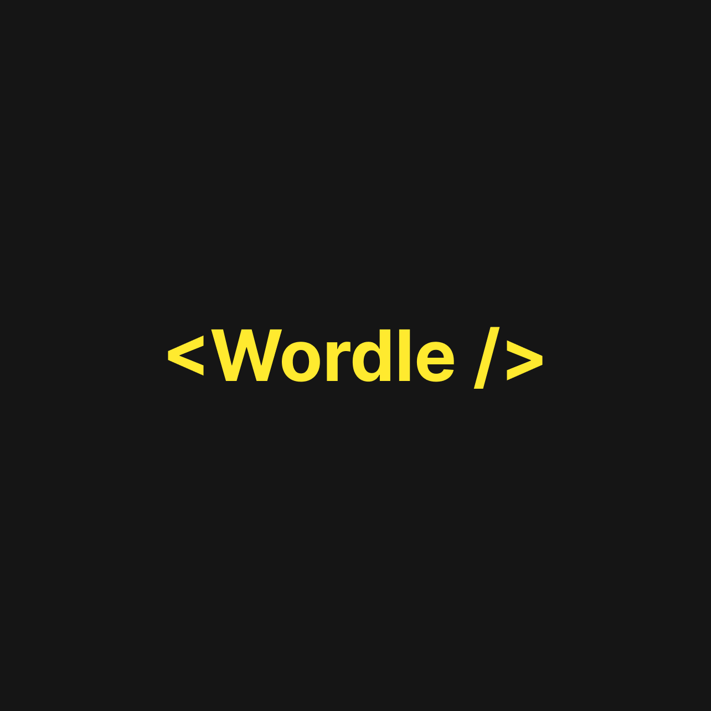
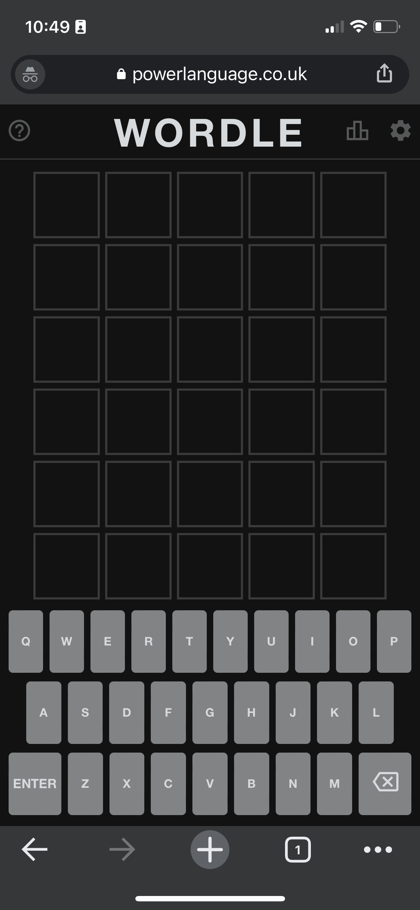
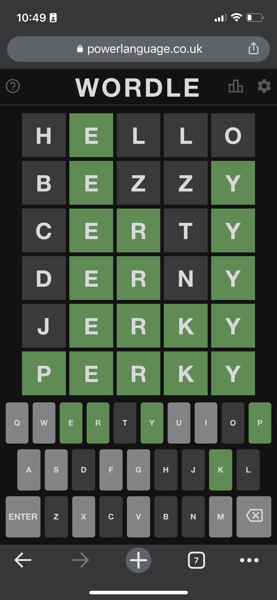
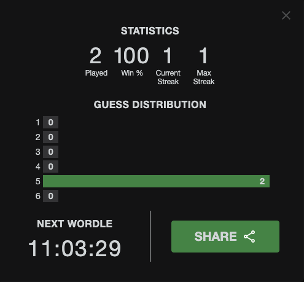

<div align='center'>




</div>

<p align='center'>
     

  
  
  <a href="https://github.com/ArthurB95/WordleApp/commits/master">
    
  </a>
</p>

<h4 align="center"> 
	🚧  Wordle  ♻️ Concluído 🚀 🚧
</h4>

## 💻 Sobre o projeto

📝 Wordle- é um clone do game <a href='https://www.nytimes.com/games/wordle/index.html'>Wordle</a> onde o usuário tem 6 tentativas de acertar a palavra do dia, caso não acerte é necessário esperar até o dia seguinte para tentar acertar uma outra palavra. No final das suas 6 tentativas é retornado as suas estatísticas.

---

## ⚙️ Funcionalidades

- [x] Deve ser possível digitar e limpar as palavras do Wordle.
- [x] Deve ser possível visualizar as suas estatísticas após as 6 tentativas impostas.
- [x] Deve ser possível compartilhar as suas estatísticas.

---

## 🚀 Como executar o projeto

```bash

# Caso deseje clonar o repositorio basta usar o comando:
$ git clone https://github.com/ArthurB95/WordleApp.git

# Caso deseje criar o projeto do zero, execute os comandos abaixo:
$ expo init MYAPP

# Após a criação do projeto necessário realizar o comando:
$ expo start

# Bibliotecas utilizadas:
$ expo install react-native-reanimated
$ expo install @react-native-async-storage/async-storage

```
---

## 🛠 Tecnologias

A tecnologia utilizada para está aplicação foi o Flutter, abaixo está a documentação oficial:

-   **[React Native](https://reactnative.dev/)**
-   **[Expo](https://expo.dev/)**
---

## 💪 Agradecimentos

- Este projeto foi realizado graças ao canal **[notJust.dev](https://www.youtube.com/c/notjustdev)**. Acesse o canal e apoie o criado.
